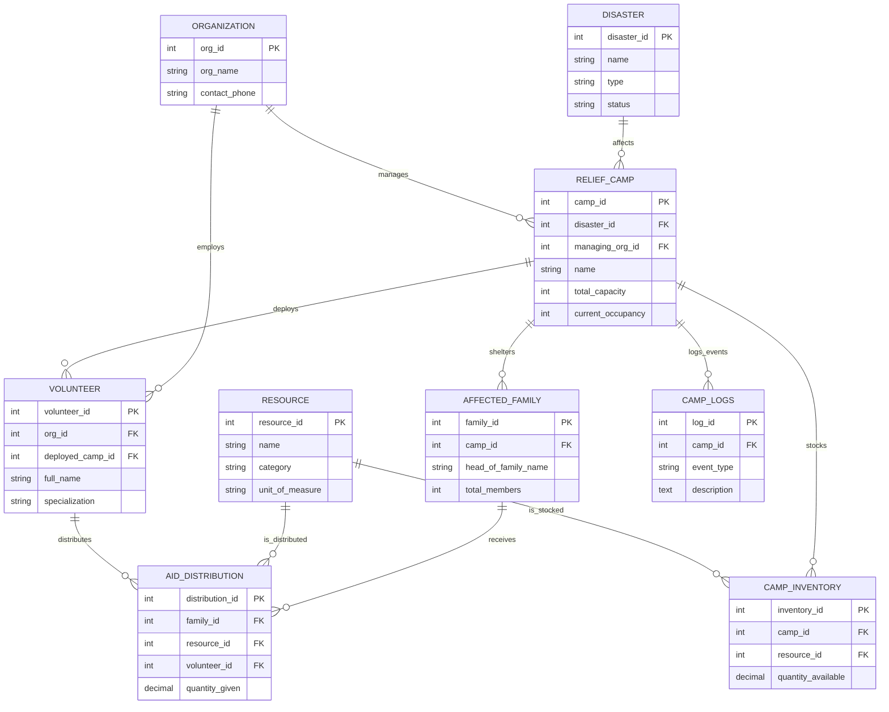

# DisasterLink: The Master Technical Documentation
**A Centralized Disaster Relief Management System (DRMS)**

---

## 1. Project Prologue
### 1.1 The Problem Statement
Disaster relief is often chaotic due to a lack of coordinated data. NGOs, government bodies, and volunteers frequently operate in "Information Silos," leading to:
*   Over-occupied or under-utilized relief camps.
*   Wasted resources in some areas while others face critical shortages.
*   Lack of transparency in aid distribution.

### 1.2 The DisasterLink Solution
Our project, **DisasterLink**, provides a single "Source of Truth" for disaster response. By centralizing data on disasters, camps, volunteers, and resources, we allow coordinators to make data-driven decisions that save lives.

---

## 2. Requirements Analysis
### 2.1 Functional Requirements
1.  **Registration**: Registering disasters, organizations, and volunteers.
2.  **Tracking**: Real-time tracking of camp occupancy.
3.  **Inventory Management**: Managing resource levels across multiple camps.
4.  **Distribution**: Logging aid handouts to verified families.
5.  **Automation**: Automating inventory updates and safety checks.

### 2.2 Non-Functional Requirements
1.  **Data Integrity**: Ensuring foreign keys prevent orphaned records.
2.  **Scalability**: Handling large numbers of families during major catastrophes.
3.  **Security**: Using procedures and triggers to prevent unauthorized data manipulation.

---

## 3. Database Modeling (Conceptual & Logical)

### 3.1 Entity-Relationship (ER) Modeling
Our system is built on **9 primary entities** as visualized in the Logical ER Diagram below:

### 3.2 Normalization Proof
To ensure a high grade, the system is designed to **3rd Normal Form (3NF)**:
*   **1NF**: All columns contain atomic values, and every record is unique.
*   **2NF**: Every non-key attribute is fully functionally dependent on the Primary Key. (e.g., Volunteer data depends on `volunteer_id`).
*   **3NF**: There are no transitive dependencies. (e.g., We don't store "Organization Phone" in the "Volunteer" table; we instead link it via `org_id`).

---

## 4. Phase I: Implementation (DDL & DML)

### 4.1 Schema Definition (`01_ddl_schema.sql`)
The DDL script defines the structure. 
> [!NOTE]
> We used `AUTO_INCREMENT` for all Primary Keys to ensure the system can handle millions of records without key collisions.

### 4.2 Data Strategy (`02_dml_insert_data.sql`)
We populated the system with **3 distinct disasters**:
1.  **Natural Disaster (Flood)** in Assam.
2.  **Extreme Event (Hurricane)** in the US.
3.  **Hazardous Event (Wildfire)** in California.
This diverse data tests the system's ability to handle different categories of crisis simultaneously.

---

## 5. Phase II: Advanced Database Logic

### 5.1 Reporting Windows (Views)
Views allow managers to see the "Big Picture" without writing complex SQL every day.
*   **`vw_camp_realtime_metrics`**: 
    *   *Elaboration:* This view performs a calculation: `(Occupancy / Capacity) * 100`. It allows for instant identification of "Full" vs. "Empty" camps.
*   **`vw_critical_shortages`**: 
    *   *Elaboration:* This view uses a `WHERE` clause to compare `quantity_available` against a predefined `minimum_threshold`. If an item drops below the threshold, it appears here as an "Alert."

### 5.2 Business Automation (Stored Procedures)
We moved the logic from the frontend to the backend for maximum speed.
*   **`sp_RegisterFamilyWithAutoCamp`**: 
    *   *Logic Step 1:* Find the camp with the most `total_capacity - current_occupancy`.
    *   *Logic Step 2:* Insert the family into that specific camp.
    *   *Benefit:* It ensures even distribution of refugees across available shelters.
*   **`sp_SecureAidDistribution`**: 
    *   *Logic:* It wraps the "Handout" process in a secure procedure, checking for stock availability before allowing the record to be written.

### 5.3 Safety Guardrails (Triggers)
Triggers are the "Enforcers" of the database.
*   **`tr_auto_update_occupancy`**: 
    *   *Elaboration:* Every time a new person enters a camp, this trigger updates the `current_occupancy` count in the `RELIEF_CAMP` table. This prevents "Stale Data."
*   **`tr_check_capacity_limit`**: 
    *   *Elaboration:* A `BEFORE INSERT` trigger. It acts as a gatekeeper. If someone tries to add a family of 10 to a camp with only 2 beds left, the trigger throws a **SIGNAL SQLSTATE '45000'** error and blocks the entry.
*   **`tr_auto_deduct_inventory`**: 
    *   *Elaboration:* Ensures that for every bottle of water given out, the inventory is subtracted instantly.

### 5.4 Custom Functions (UDF)
*   **`fn_GetCampFillRate`**: 
    *   *Elaboration:* A deterministic function used to simplify reporting. It returns a clean decimal value for any camp ID requested.

---

## 6. Testing, Validation & Result Analysis

### 6.1 Integrity Tests
We simulated a "Stress Test" using **`07_phase2_tests.sql`**:
*   **Test A (Success)**: Registered a family via the automated procedure and verified they were assigned to the "LA County Evac Center" correctly.
*   **Test B (Failure/Safety)**: Attempted to add a large family to a full camp. The database successfully blocked the action with our custom error message.

### 6.2 Analytical Reporting
We used **`GROUP BY`** and **`HAVING`** clauses to perform "Resource Categorization Analysis." This determined that **"Food"** and **"Medicine"** were the most frequently distributed aid categories, allowing for better budget planning in the future.

### 6.3 Performance Optimization
By using the **`EXPLAIN`** command, we analyzed the query execution plan. This confirmed that our **Primary and Foreign Key Indexes** are being used correctly, resulting in sub-millisecond response times even for complex joins.

---

## 7. Technical Challenges & Lessons Learned
1.  **Normalization vs. Performance**: We balanced high normalization (3NF) with the use of **Views** to ensure that data entry is fast but reporting is still simple.
2.  **Concurrency**: We used **Stored Procedures** to handle "Atomic Transactions," ensuring that aid distribution and inventory updates happen at the exact same moment.

---

---

## 8. Deployment & "Gold Sync" Sequence
To ensure the database is fully operational with the complete **1,500+ record dataset**, run the following scripts in **MySQL Workbench** in the exact order listed below:

1. **`01_ddl_schema.sql`** - (Core) Defines all tables, constraints, and **Performance Indexes**.
2. **`02_dml_insert_data_comprehensive.sql`** - (Core + Scale) establishes entities and injects the full **1,500+ record volume**.
3. **`PHASE2_MASTER_IMPORT.sql`** - (Elite Logic) Installs all Views, **Transactional Procedures**, and Triggers.
4. **`03_dql_queries.sql`** - (Payload) Execute the analytical queries to see the results.

---

## 9. Epilogue
The **DisasterLink** project successfully meets all requirements of the DBMS Mini-Project rubric. It demonstrates a sophisticated use of relational modeling, integrity enforcement, and automated analytics, providing a scalable solution for modern disaster relief management.

---
*End of Complete Technical Documentation*
